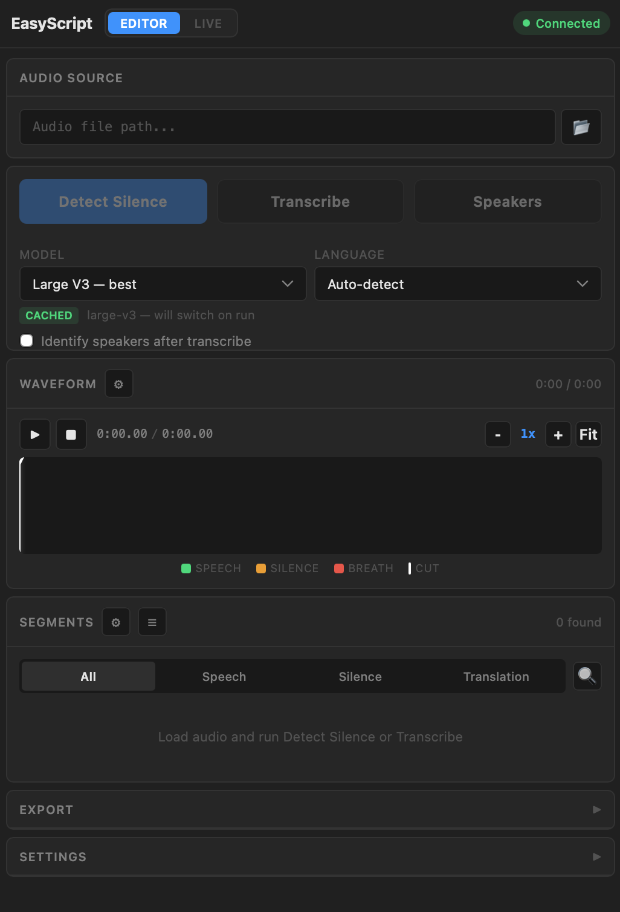
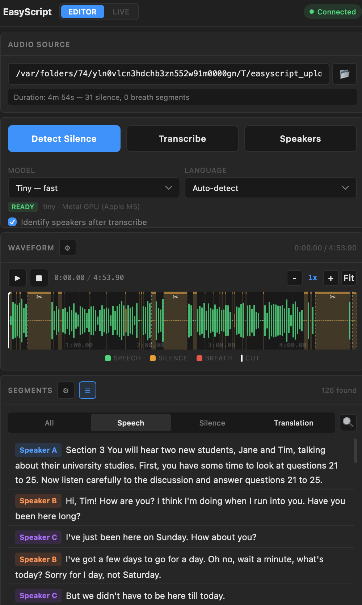
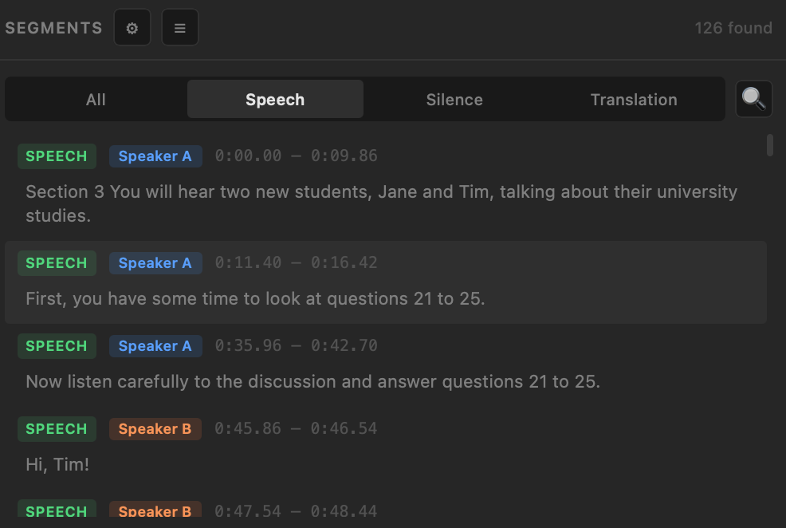
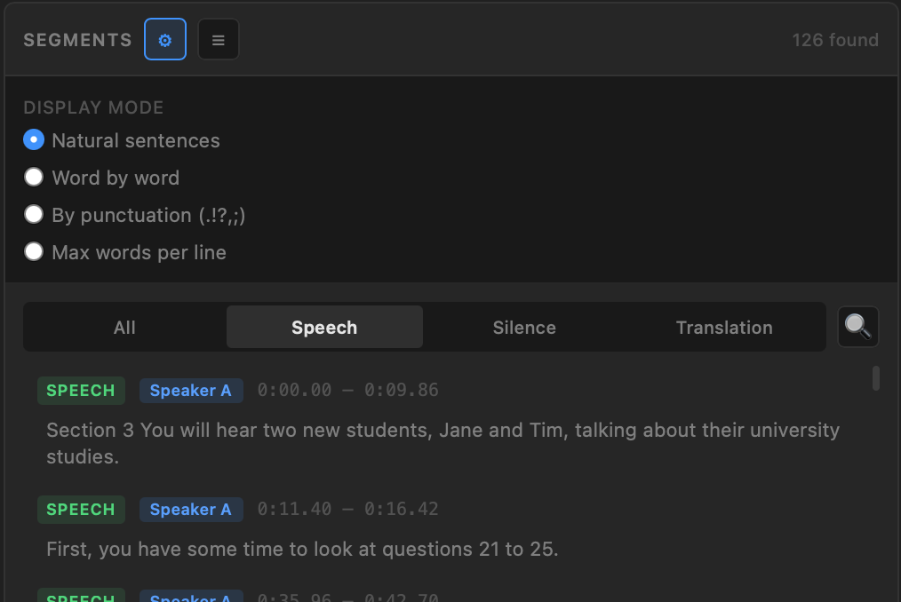
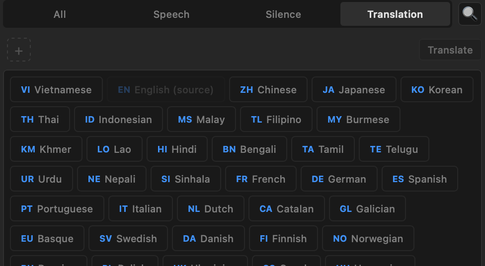
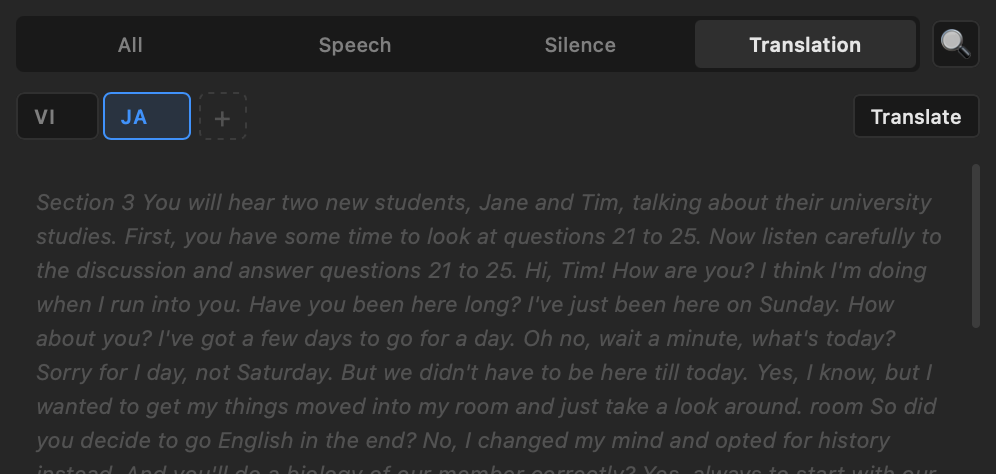
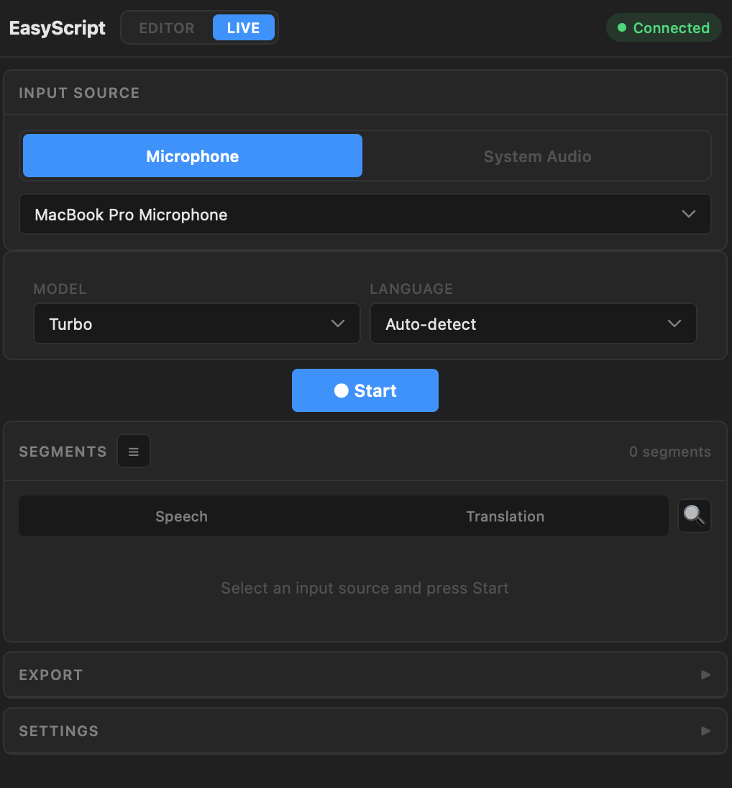

# EasyScript

**Standalone desktop transcription & translation app** powered by Whisper AI. Transcribe audio/video files or live microphone input with real-time sentence splitting, speaker diarization, and multilingual translation.

Built for macOS (Apple Silicon optimized with Metal GPU acceleration) and Windows (CUDA support).

---

## Screenshots

### Editor Mode — Main Interface
Load audio files, detect silence, transcribe speech, and identify speakers — all from a clean, intuitive interface with waveform visualization.



### Waveform & Speaker Diarization
Interactive waveform viewer with color-coded speech/silence/breath segments. After running speaker diarization, each segment is labeled with the identified speaker (Speaker A, B, C...) in distinct colors.



### Speech Segments with Speaker Labels
Transcribed segments are displayed with speaker identification, timecodes, and the transcribed text. Filter by All, Speech, Silence, or Translation tabs.



### Display Mode Settings
Choose how text is displayed: Natural sentences, Word by word, By punctuation, or Max words per line — flexible formatting for different use cases.



### Translation — Language Selection
Translate transcriptions into 30+ languages. Click "+" to add a target language from the language picker with support for Vietnamese, Chinese, Japanese, Korean, Thai, and many more.



### Translation — Text View
View translations in a continuous text format. Add multiple target languages (e.g., Vietnamese + Japanese) with tabs to switch between them.



### Live Mode — Real-time Transcription
Record from your microphone and get real-time transcription with sentence-level splitting. Choose the Turbo model for fast Vietnamese transcription, or any other model for your language.



---

## Features

### Editor Mode — File-based Transcription
- **Audio/Video file support** — Load any audio or video file for analysis
- **Silence & breath detection** — Detect silent and breath segments using FFmpeg-based VAD
- **AI Transcription** — Speech-to-text using Whisper (MLX on Apple Silicon, faster-whisper on CUDA/CPU)
- **Speaker diarization** — Identify who speaks when using pyannote-audio 4.0
- **Interactive waveform** — Zoomable waveform viewer with playback, cut markers, and segment navigation
- **Search & Replace** — Find and replace text across all segments
- **Multiple display modes** — Natural sentences, word-by-word, punctuation-based, or max-words-per-line
- **Translation** — Translate segments using Ollama (local) or Claude API (cloud)
- **Export** — Export to XML (Premiere Pro timeline), SRT subtitles (original or after cuts)

### Live Mode — Real-time Transcription
- **Microphone input** — Record and transcribe from any connected microphone
- **System Audio** — Capture browser tab audio (browser mode only)
- **Real-time sentence splitting** — Sentences split at punctuation marks (`.!?;,`) as you speak
- **Live translation** — Each sentence is translated immediately after finalization
- **Speech / Translation tabs** — Speech tab shows fast real-time transcription; Translation tab holds position until translation completes for reading comfort
- **Pause / Continue / Stop** — Full session control with data preservation
- **Non-blocking pipeline** — Heavy Whisper inference runs asynchronously, never blocking audio capture

### Transcription Models
| Model | Size | Speed | Quality |
|-------|------|-------|---------|
| Tiny | ~75MB | Fastest | Basic |
| Base | ~140MB | Fast | Good |
| Small | ~460MB | Medium | Better |
| Medium | ~1.5GB | Slow | Great |
| **Turbo** | **~800MB** | **Fast** | **Best for Vietnamese** |
| Large V3 | ~3GB | Slowest | Best overall |

### GPU Acceleration
- **Apple Silicon** (M1/M2/M3/M4) — MLX backend with Metal GPU, optimized for macOS
- **NVIDIA GPU** — faster-whisper with CUDA acceleration
- **CPU fallback** — Automatic fallback when no GPU available

---

## Installation

### Option 1: Download Standalone App (Recommended)

Download `EasyScript.app` from [Releases](https://github.com/XavierChuu/EasyScript/releases) and drag to Applications.

### Option 2: Build from Source

**Requirements:**
- Python 3.11+
- FFmpeg (`brew install ffmpeg`)
- macOS 13+ (for Apple Silicon MLX) or Windows with NVIDIA GPU

```bash
# Clone repository
git clone https://github.com/XavierChuu/EasyScript.git
cd EasyScript

# Build standalone app
chmod +x scripts/build_app.sh
./scripts/build_app.sh

# App will be at dist/EasyScript.app (macOS)
open dist/EasyScript.app
```

### Option 3: Development Mode

```bash
# Setup backend
cd backend
python3.11 -m venv venv
source venv/bin/activate
pip install -r requirements.txt

# Start backend server
python server.py
# Server runs at http://localhost:9876

# In another terminal, serve frontend
npx serve ./plugin
# Open http://localhost:3000 in browser
```

---

## Usage Guide

### Editor Mode

#### 1. Load Audio
- Click the **folder icon** next to the audio path field
- Select any audio or video file (MP3, WAV, M4A, MP4, MOV, etc.)
- Audio info (duration, sample rate, channels) will be displayed

#### 2. Detect Silence
- Click **"Detect Silence"** to analyze the audio
- The waveform will show speech (blue), silence (gray), and breath (orange) segments
- Adjust cut settings (padding, min silence, threshold) via the gear icon on the waveform

#### 3. Transcribe
- Select your preferred **Model** (Turbo recommended for Vietnamese)
- Select **Language** (or leave as Auto-detect)
- Optionally check **"Identify speakers after transcribe"**
- Click **"Transcribe"** — progress bar shows real-time status with ETA
- Right-click to resume transcription from the current playhead position

#### 4. Speaker Diarization
- Requires a **HuggingFace token** (configure in Settings)
- Accept terms at [pyannote/speaker-diarization-3.1](https://huggingface.co/pyannote/speaker-diarization-3.1)
- Click **"Speakers"** to identify who speaks when
- Speakers are labeled as Speaker A, Speaker B, etc.

#### 5. Translate
- Switch to the **Translation** tab in segments
- Click **"+"** to add a target language
- Click **"Translate"** to translate all segments
- Supports Ollama (local, free) or Claude API (cloud, higher quality)

#### 6. Export
- **Export XML** — Premiere Pro compatible timeline with cuts applied
- **Export SRT (Original)** — Subtitles with original timecodes
- **Export SRT (After Cuts)** — Subtitles adjusted for silence removal
- Choose output folder via the folder selector

### Live Mode

#### 1. Select Input Source
- **Microphone** — Select from available microphones
- **System Audio** — Capture browser tab audio (only works in browser mode, not in bundled app)

#### 2. Configure
- Select transcription **Model** (Turbo recommended)
- Select **Language**
- Optionally enable **Translation** with target language

#### 3. Start Recording
- Click **"Start Live"** to begin real-time transcription
- Speech is transcribed and split into sentences in real-time
- Switch between **Speech** and **Translation** tabs:
  - **Speech tab** — Shows transcription as fast as possible
  - **Translation tab** — Holds position until translation for current sentence is ready

#### 4. Session Controls
- **Pause** — Temporarily stop recording, stay in focus mode
- **Continue** — Resume recording without clearing data
- **Stop** — End session, return to full UI with all data preserved for export
- **New** — Start a fresh session (clears previous data)

---

## Settings

### HuggingFace Token
Required for speaker diarization. Get your token at [huggingface.co/settings/tokens](https://huggingface.co/settings/tokens).

### Translation Provider
- **Ollama (Local)** — Free, runs locally. Install [Ollama](https://ollama.ai) and pull a model
- **Claude API (Cloud)** — Higher quality translations. Requires an [Anthropic API key](https://console.anthropic.com)

---

## Architecture

```
EasyScript/
├── plugin/                 # Frontend (HTML/CSS/JS)
│   ├── index.html          # Main UI layout
│   ├── index.js            # App logic, WebSocket handling
│   └── styles.css          # Styling
├── backend/                # Python backend
│   ├── server.py           # FastAPI server + WebSocket live streaming
│   ├── transcriber.py      # Whisper transcription (MLX / faster-whisper)
│   ├── silence_detector.py # FFmpeg-based silence/breath detection
│   ├── diarizer.py         # Speaker diarization (pyannote-audio)
│   ├── translator.py       # Translation (Ollama / Claude API)
│   ├── main.py             # PyWebView launcher
│   ├── easyscript.spec     # PyInstaller build spec
│   └── requirements.txt    # Python dependencies
├── scripts/
│   └── build_app.sh        # Build standalone app script
└── README.md
```

### Tech Stack
- **Frontend:** HTML/CSS/JS (runs in browser or PyWebView)
- **Backend:** Python 3.11, FastAPI, uvicorn
- **Transcription:** mlx-whisper (Apple Silicon Metal GPU) / faster-whisper (CUDA/CPU)
- **Speaker ID:** pyannote-audio 4.0 + torchcodec
- **Live mode:** WebSocket streaming, webrtcvad sentence splitting
- **Translation:** Ollama (local) / Claude API (cloud)
- **Distribution:** PyInstaller bundled .app

---

## API Endpoints

The backend exposes a REST API at `http://localhost:9876`:

| Method | Endpoint | Description |
|--------|----------|-------------|
| GET | `/health` | Server health check + GPU info |
| POST | `/upload` | Upload audio/video file |
| POST | `/analyze` | Detect silence/breath segments |
| POST | `/transcribe` | Transcribe audio to text |
| POST | `/diarize` | Speaker diarization |
| POST | `/translate` | Batch translate segments |
| POST | `/translate/one` | Translate single segment |
| GET | `/models` | List available models |
| GET | `/model/status` | Check if model is cached |
| WebSocket | `/ws/live` | Live transcription stream |

---

## System Requirements

- **macOS:** 13.0+ (Ventura or later), Apple Silicon recommended
- **Windows:** Windows 10+, NVIDIA GPU recommended
- **RAM:** 8GB minimum, 16GB recommended for large models
- **Storage:** ~1GB for app + model storage (varies by model size)
- **FFmpeg:** Required (bundled in standalone app)

---

## License

MIT License

## Credits

- [Whisper](https://github.com/openai/whisper) by OpenAI
- [mlx-whisper](https://github.com/ml-explore/mlx-examples) by Apple MLX team
- [faster-whisper](https://github.com/SYSTRAN/faster-whisper) by SYSTRAN
- [pyannote-audio](https://github.com/pyannote/pyannote-audio) for speaker diarization
- [FastAPI](https://fastapi.tiangolo.com/) for the backend framework
